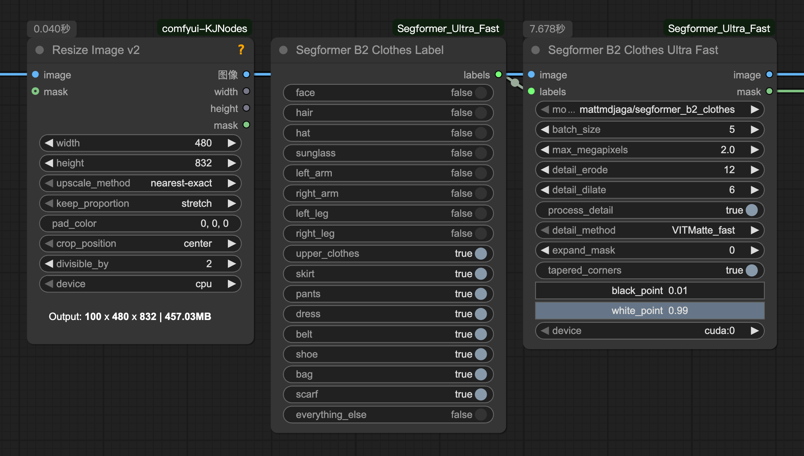
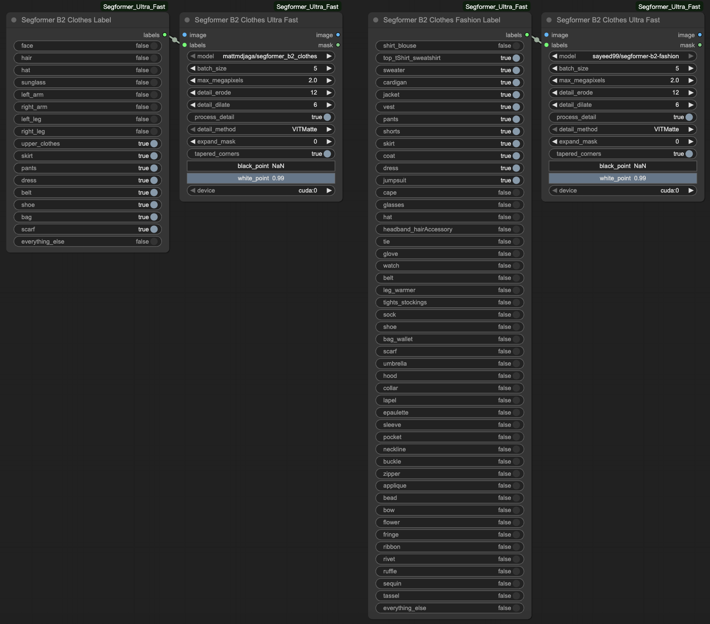

# Comfyui-QwenPromptRewriter
Run Segformer models at lightning speed for image/video segmentation.  

以极快的速度运行 Segformer 模型进行图像/视频内容分割.  

## Preview / 效果演示

## Usage / 使用方法
Select the model you want to use and connect the corresponding Label generator node and image input to generate the segmentation mask.  

选择需要使用的模型, 并连接对应的Label生成器节点和图像输入, 即可快速分割出所需的遮罩.

## Donate / 赞助我

## Thanks / 特别鸣谢
[ComfyUI_LayerStyle](https://github.com/chflame163/ComfyUI_LayerStyle) @chflame163
